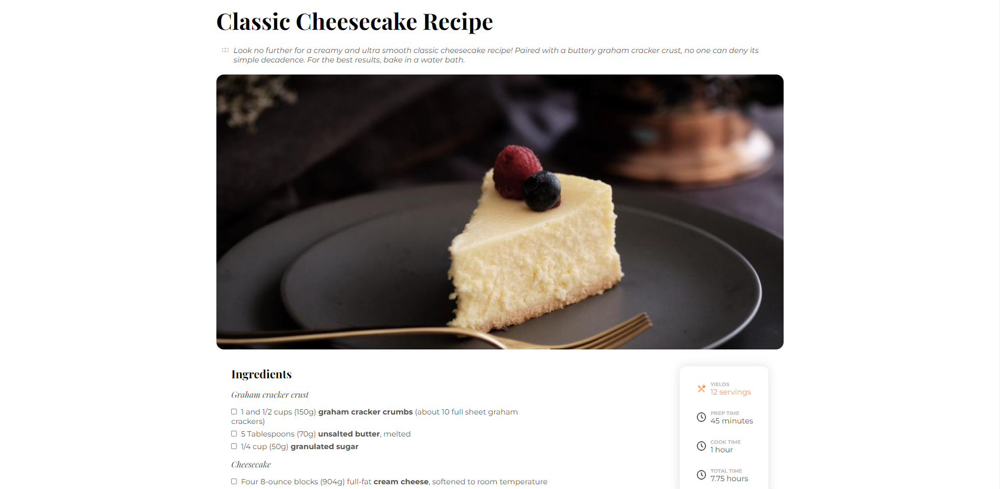
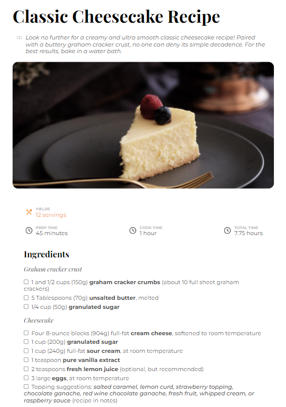
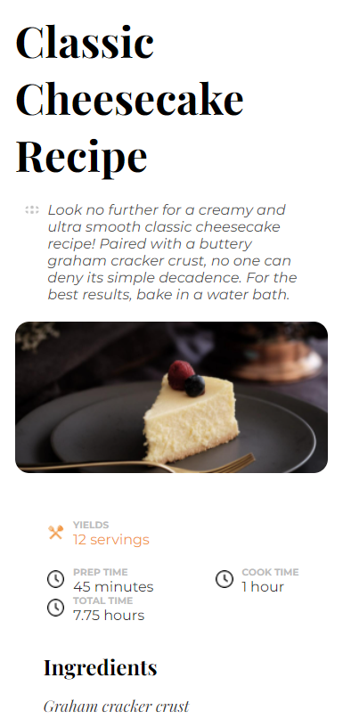

<h1 align="center">Reecipe Page</h1>

   Solution for a challenge from  <a href="http://devchallenges.io" target="_blank">Devchallenges.io</a>.

  <h3>
    <a href="https://recipe-page-sahajunior.netlify.app/">
      Demo
    </a>
     | 
    <a href="https://devchallenges.io/solutions/CFhZn4VmO5jYVpZZwb9L">
      Solution
    </a>
     | 
    <a href="https://devchallenges.io/challenges/OEKdUZ6xs0h99C38XVht">
      Challenge
    </a>
  </h3>

## Table of Contents

- [Overview](#overview)
  - [Screenshots](#screenshots)
  - [Built With](#built-with)
- [Features](#features)
- [Acknowledgements](#acknowledgements)
- [Contact](#contact)

## Overview

### Screenshots

| Desktop View (Width: 1280px)                        | Tablet View (Width: 912px)                       | Mobile View (Width: 390px)                              |
| --------------------------------------------------- | ------------------------------------------------ | ------------------------------------------------------- |
|  |  |  |

Introducing Project:

- It was a fantastic experience to work with a subtle web page.

### Built With

- [HTML](https://html.com/)
- [CSS](https://www.w3.org/Style/CSS/Overview.en.html)

## Features

This application/site was created as a submission to a [DevChallenges](https://devchallenges.io/challenges) challenge. The [challenge](https://devchallenges.io/challenges/Jymh2b2FyebRTUljkNcb) was to build an application to complete the given user stories.

## Acknowledgements

- [Steps to replicate a design with only HTML and CSS](https://devchallenges-blogs.web.app/how-to-replicate-design/)

## Contact

- GitHub [@sahajunior](https://github.com/sahajunior)
- Twitter [@_saha_junior_](https://twitter.com/_saha_junior_)
- Instagram [@_saha_junior_](https://instagram.com/_saha_junior_/)
